uSpec connects your AI agent and Figma into a single pipeline. The **uSpec Extract** plugin captures a component, `create-component-md` turns that capture into a single self-contained `.md` specification, and the `create-*` skills render sections of that `.md` back into Figma as annotation frames.

## The pipeline

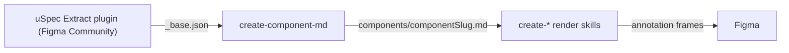

Everything flows through the Component Markdown file. It is the required input for every `create-*` render skill — there is no longer a path that points a render skill straight at a raw Figma link.

<CardGroup cols={2}>
  <Card title="Component Markdown (.md)" icon="file-code" href="/specs/component-md">
    The source of truth, written to disk by `create-component-md`. Best for feeding specs to any LLM (Cursor, Claude Design, GPT), committing alongside code, or diffing across design iterations.
  </Card>
  <Card title="Figma annotations" icon="figma">
    Annotation frames rendered next to the component by the `create-*` skills, drawn from the `.md`. Best for design reviews, spec handoff inside Figma, and component libraries where the spec lives beside the component.
  </Card>
</CardGroup>

### Stage 1: generate the `.md`

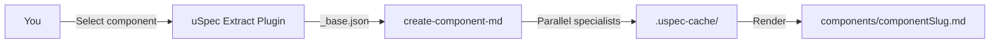

The plugin runs deterministic extraction inside Figma's sandbox (no network calls), producing a `_base.json` that captures every variant, token binding, and sub-component. The `create-component-md` skill then runs four parallel interpretation agents (API, structure, color, voice), reconciles their outputs, and renders a single Markdown file. See the [Component Markdown page](/specs/component-md#how-it-works) for the full pipeline diagram.

### Stage 2: render into Figma

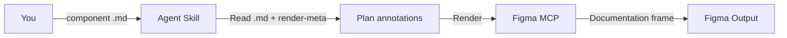

Every `create-*` skill reads its section from the component `.md` — plus the render-meta that maps each section to Figma node ids — then renders documentation directly in Figma through the MCP. They do not re-extract the component over MCP; any live read is a small, whitelisted verification or measurement delta. The internal steps differ depending on what each skill renders. The diagrams below show what happens inside each skill.

---

## Triggering a skill

<Tabs>
  <Tab title="Cursor">
    Skills are triggered by typing `@` followed by the skill name in Cursor's chat.

    <Steps>
      <Step title="Type @">
        In Cursor's chat, type `@`. Cursor shows an autocomplete menu of available skills.
      </Step>
      <Step title="Select a skill">
        Continue typing to filter (e.g., `@create-v`) or use arrow keys to select. The skill name must match exactly: `@create-voice`, not `create voice` or `voice spec`.
      </Step>
      <Step title="Add your prompt">
        After the skill name, pass the component `.md` (e.g. `./components/button.md`) and add any context the spec can't carry: which Figma node to render next to, or behaviors and edge cases.
      </Step>
    </Steps>

    <Tip>
      If autocomplete doesn't show the skill, verify your project is open in Cursor and that `.cursor/skills/` is populated. If the directory is empty, run `npx uspec-skills install --platform cursor` from the project root.
    </Tip>
  </Tab>

  <Tab title="Claude Code">
    Skills are triggered with `/skill-name` or by asking naturally — Claude auto-discovers skills from their description.

    <Steps>
      <Step title="Invoke a skill">
        Type `/create-voice` to invoke directly, or just describe what you need (e.g., "create a screen reader spec"). Claude matches skills from `.claude/skills/` by their description.
      </Step>
      <Step title="Pass the component .md">
        Point the skill at the component `.md` and describe the states, variants, behaviors, or render destination you want documented.
      </Step>
    </Steps>

    <Tip>
      Skills live in `.claude/skills/` under the project where you ran `npx uspec-skills init`. Make sure you launch `claude` from that directory so it can discover them.
    </Tip>
  </Tab>

  <Tab title="Codex">
    Skills are triggered with `$skill-name` or matched implicitly from their description.

    <Steps>
      <Step title="Invoke a skill">
        Type `$` to mention a skill explicitly (e.g., `$create-voice`), or describe what you need and Codex matches skills from `.agents/skills/` by their `description` frontmatter. Use `/skills` to browse available skills.
      </Step>
      <Step title="Pass the component .md">
        Point the skill at the component `.md` and describe the states, variants, behaviors, or render destination you want documented.
      </Step>
    </Steps>

    <Tip>
      Skills live in `.agents/skills/` under the project where you ran `npx uspec-skills init`. Make sure you launch Codex from that directory so it can discover them.
    </Tip>
  </Tab>
</Tabs>

---

## Inside each skill

Every render skill loads an instruction file, reads platform-specific or domain-specific reference files, reads its section from the component `.md` (plus the render-meta node ids), runs through a checklist, and renders the output via the MCP. Any live Figma read is a small, whitelisted verification or measurement delta — not a re-extraction. The reference files determine what the agent knows about each domain. (`create-component-md`, the stage-1 generator, is the exception: it reads a plugin `_base.json` rather than a `.md`.)

<Tabs>
  <Tab title="Component Markdown">
    The `create-component-md` orchestrator is the only skill that does not render into Figma. It consumes a plugin-produced `_base.json`, dispatches four interpretation specialists (one serial, three in parallel), reconciles typed disagreements, then renders a single `.md` file to disk.

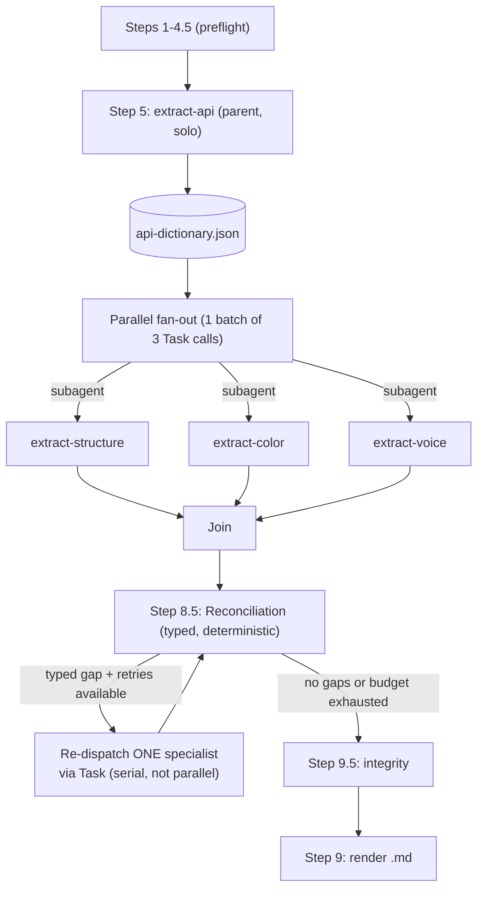

  The API specialist runs first and solo because its output (the property dictionary) anchors the three downstream specialists on a shared property and state vocabulary. Structure, color, and voice then run in a single parallel batch so their contexts stay isolated and the parent orchestrator only holds the returned summaries. Reconciliation is typed and deterministic: each disagreement has a defined signature (conflicting child classification, mismatched axes, missing states), and only the matching specialist is re-dispatched. The integrity gate validates cache-file shapes, axis consistency, and the structure coverage matrix before the Markdown renderer runs.

  See the [Component Markdown spec page](/specs/component-md) for install, usage, and output details.
  </Tab>

  <Tab title="Anatomy">
    The anatomy skill extracts child layers, element types, and property definitions, then classifies each element's role before rendering numbered markers with an attribute table directly in Figma.

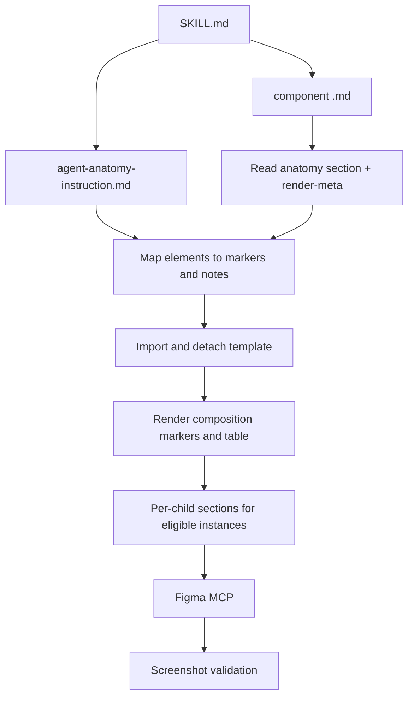

  The skill reads child layers, element types, visibility, and property definitions (booleans, variant axes, instance swaps) from the component `.md`. The `.md` already records each element's role (optional slot, fixed sub-component, content element, structural/decorative) and semantic notes from the `create-component-md` run, so the skill maps those onto markers rather than re-classifying. Utility sub-components like Spacer and Divider are automatically skipped. Eligible nested instances get their own per-child sections with separate markers and tables, and cross-references link back from the composition table.
  </Tab>

  <Tab title="Properties">
    The property skill extracts variant axes, boolean toggles, variable modes, and child component properties, then renders visual exhibits with live instance previews directly in Figma.

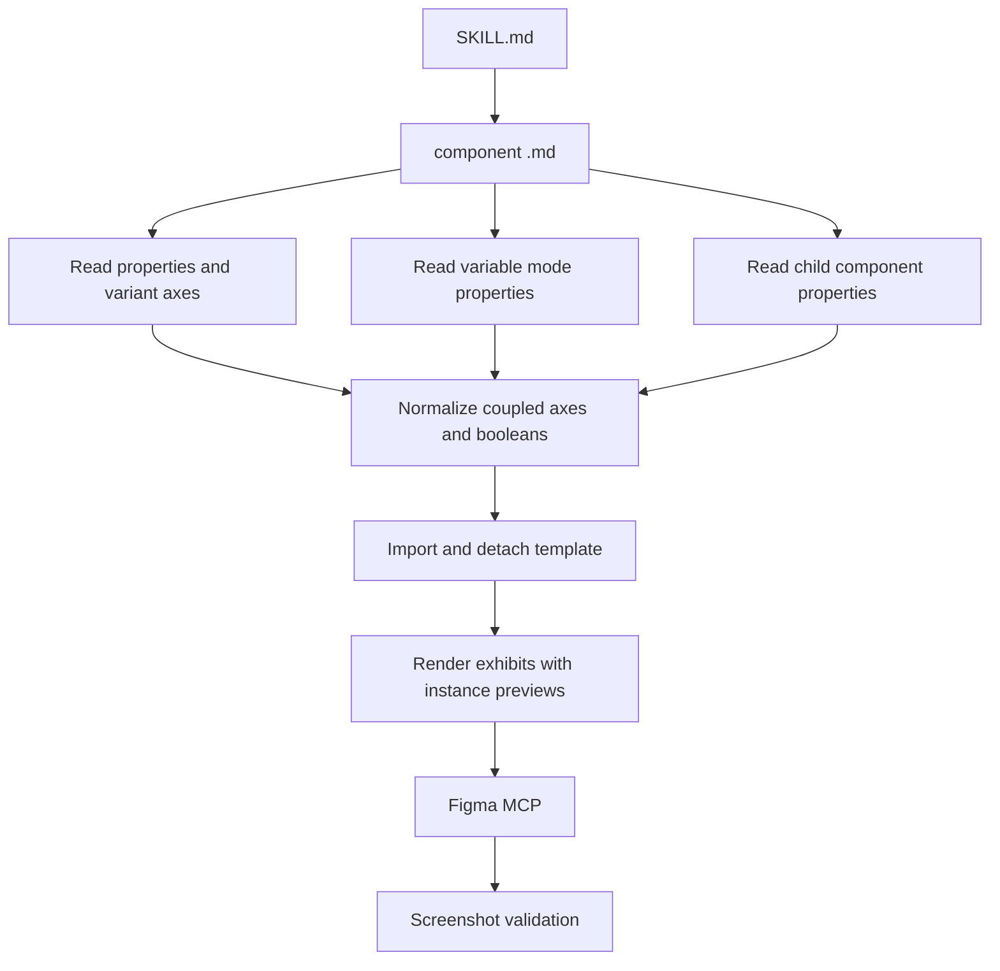

  The skill reads the API and properties sections of the `.md` to recover all variant axes, boolean toggles, and instance swap properties. Variable mode collections (shape, density) are already resolved in the `.md`. Child component properties are rendered in-context on parent instances using live instances placed via the MCP.
  </Tab>

  <Tab title="API">
    The API skill loads its instruction file, identifies all configurable properties (including sub-component slots), and renders property tables with configuration examples directly in Figma.

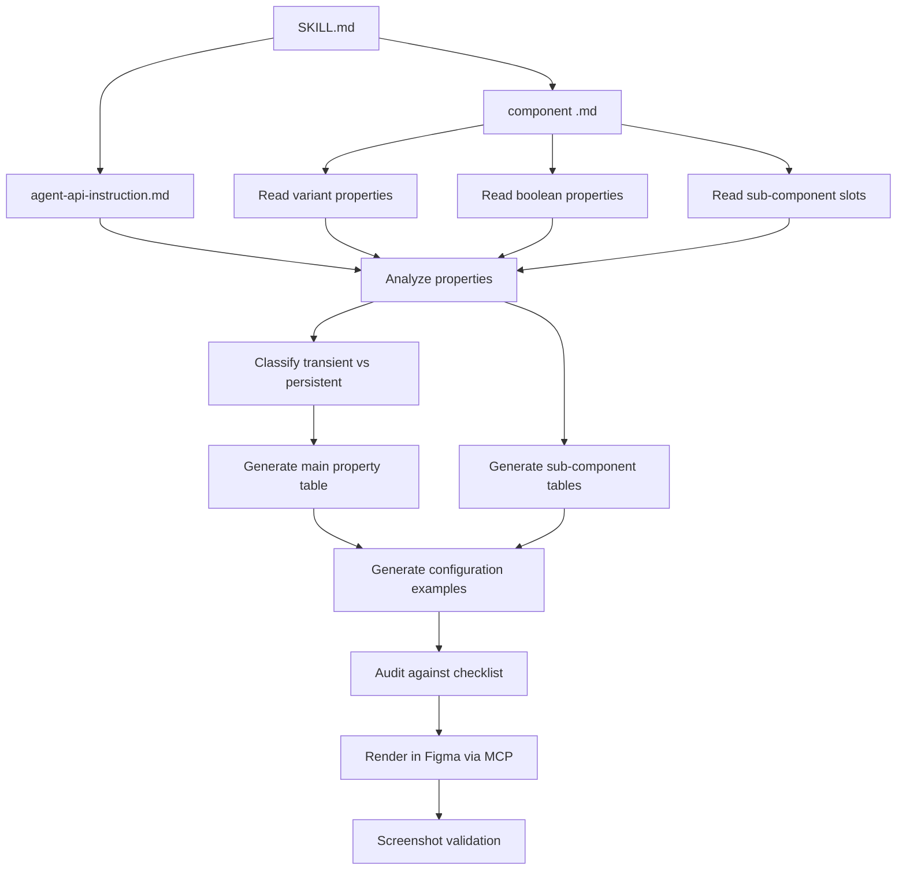

  The API section of the `.md` already lists every variant property, boolean toggle, and sub-component slot. Transient states like hovered and pressed are excluded from the API — they are handled at runtime. Only persistent, configurable properties like `isDisabled` or `isSelected` become API entries.
  </Tab>

  <Tab title="Structure">
    The structure skill uses a two-tier architecture: deterministic scripts handle data extraction and rendering, while AI reasoning is focused on interpretation and planning.

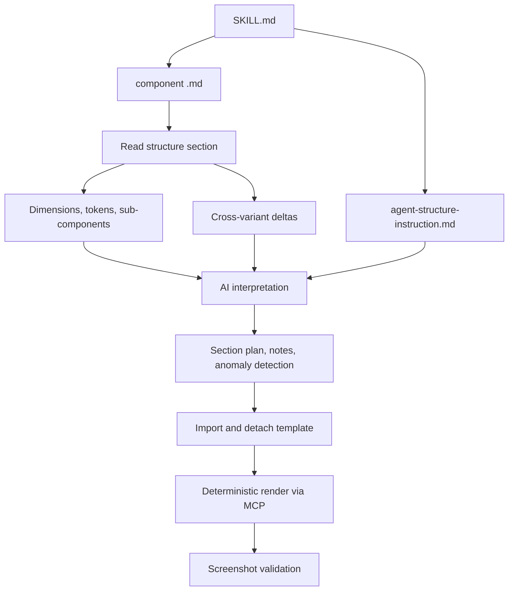

  The structure section of the `.md` already carries the dimensions, token references, sub-component walks, and cross-variant deltas (measured deterministically during the `create-component-md` run). The skill's reasoning budget is spent on interpretation — building the section plan, writing design-intent notes, and detecting anomalies — rather than data gathering. Values are reported as token references when bound to a variable (e.g., `sizing-button-lg (56)`) or as plain numbers when hardcoded.
  </Tab>

  <Tab title="Color Annotation">
    The color skill loads a single instruction file, then extracts design tokens and variable values from Figma, classifies which axes and modes affect color, chooses a rendering strategy, and renders the annotation directly in Figma.

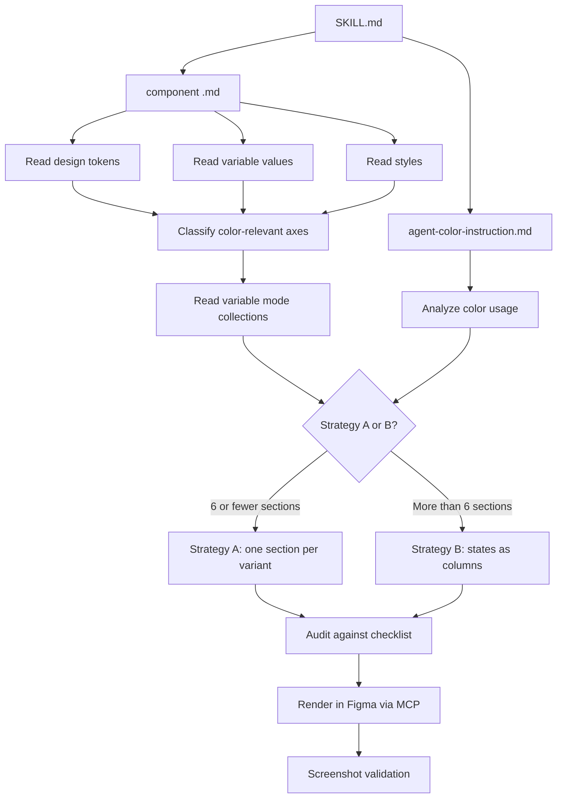

  The color section of the `.md` records per-element token mappings using your actual token naming conventions rather than generic names. Because `create-component-md` enables hidden boolean toggles during extraction, the `.md` already captures color bindings that only appear when optional elements are visible. The strategy decision determines the output layout: Strategy A renders one section per variant for simpler components, while Strategy B uses states as table columns for components with many variant combinations.
  </Tab>

  <Tab title="Screen Reader">
    The screen reader skill loads four reference files, one for general instructions and one per platform, then runs a merge analysis to determine focus stops before rendering per-platform tables directly in Figma.

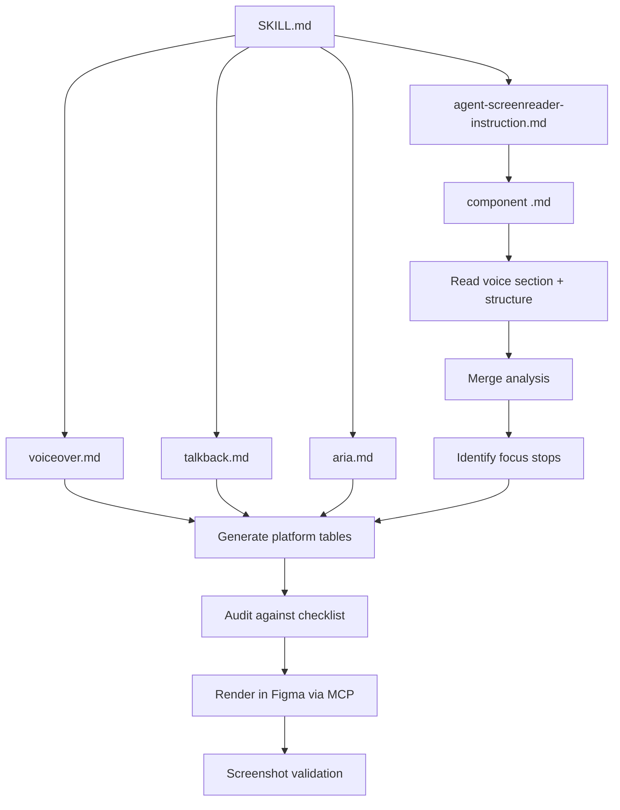

  The voice section of the `.md` already records the focus order and merge analysis — which visual parts become independent focus stops and which get merged into a parent announcement. The three platform files provide the exact property names and announcement patterns for iOS, Android, and Web.
  </Tab>

  <Tab title="Motion">
    The motion skill is unique: instead of extracting data from Figma, it reads pre-computed animation data exported from After Effects. The `export-timeline.jsx` script does the heavy lifting — pairing keyframes into segments, computing cubic-bezier easing curves, and filtering out static segments. The agent reads the segments directly and renders them as a timeline visualization in Figma.

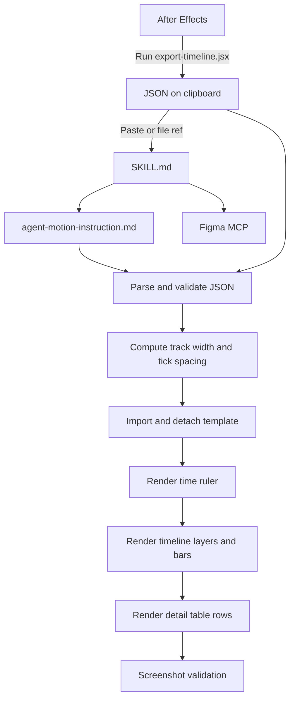

  This is a two-step process: first run the export script in After Effects to get the JSON, then run the `create-motion` skill with that output. The JSON contains composition metadata (name, duration, fps, dimensions) and a flat array of layers, each with pre-computed segments containing timing, values, bar labels, and easing data. The agent computes only layout values (track width, pixels per millisecond) and passes everything else through to Figma.
  </Tab>
</Tabs>

---

## What the pipeline captures vs. what you provide

The uSpec Extract plugin and `create-component-md` capture structure, tokens, and styles into the `.md` automatically. But some information only exists in your head — add it in the plugin's design-intent field or in your prompt:

| The pipeline captures | You need to describe |
|----------------------|---------------------|
| Component layers and hierarchy | States not visible in the captured variants |
| Design token names and values | Behavioral modes (fill vs. hug, truncation) |
| Variant axes and properties | Focus order preferences |
| Visual dimensions and spacing | Platform-specific interaction details |
| Styles and color values | Business logic or conditional rules |

<Tip>
  The more context you provide when generating the `.md`, the more accurate every downstream render is. A one-line prompt works, but adding states, behaviors, and edge cases produces significantly better specs.
</Tip>

---

## Architecture overview

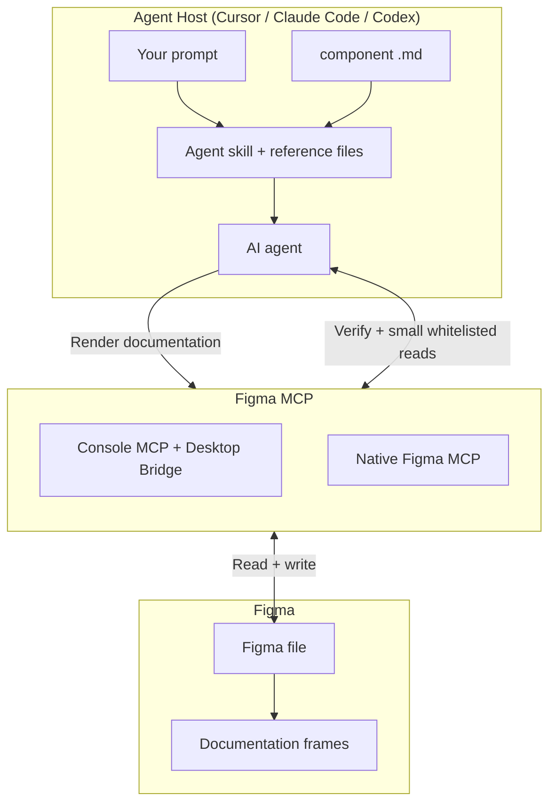

The component data, tokens, and styles a render skill needs come from the `.md` — not a live MCP extraction. The MCP is the render channel back into Figma, plus the occasional small whitelisted read for verification or a measurement delta. uSpec supports two Figma MCP providers — choose the one that fits your setup:

- **Figma Console MCP** (by Southleft) connects via a Desktop Bridge plugin running inside Figma Desktop, communicating over WebSocket. It exposes 59+ tools for design creation and variable management.
- **Native Figma MCP** (by Figma) connects directly to Figma's API with read and write access. No Desktop Bridge plugin required.

Both providers let the agent render annotation frames into Figma and capture screenshots for validation. Every render skill draws through the MCP, regardless of which provider or host you use. See [Getting Started](/getting-started#2-set-up-figma-mcp) for setup instructions.

<Note>
  MCP providers update their capabilities and setup instructions frequently. For the latest details, see the [Figma Console MCP docs](https://docs.figma-console-mcp.southleft.com/) or the [native Figma MCP docs](https://github.com/figma/figma-mcp).
</Note>
