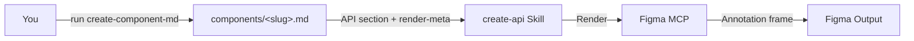

<Frame>
  <video src="/images/specs/api-output.mp4" autoPlay muted loop playsInline alt="Example API spec output in Figma" />
</Frame>

API specs document all configurable properties for a component: values, defaults, required vs. optional, and usage examples. This gives engineers a clear reference for implementing the component.

<Tip>
  `create-api` now renders **from the [Component Markdown](/specs/component-md) source of truth**. Run `create-component-md` first to produce `components/<slug>.md`; this skill reads its API section + `render-meta` and renders the Figma frame. It no longer re-extracts from Figma, and it fails fast if the `.md` is missing.
</Tip>

## What you need

- A **component `.md`** produced by `create-component-md` (run it first — `create-component-md` needs a `_base.json` from the uSpec Extract plugin). Tell the skill where this `.md` lives — `components/<slug>.md` is only `create-component-md`'s default output path; the file can live anywhere. Without it this skill aborts.
- **Figma MCP** connected (Console MCP with Desktop Bridge, or native Figma MCP) — used only to render the frame.
- Context about properties, accepted values, or nested component configurations is captured upstream by `create-component-md`; nothing extra is needed here.

<Tip>
  Mention which properties are required, what the defaults are, and any sub-components that have their own configuration (e.g., a trailing button inside a section heading).
</Tip>

## How to use

Reference the skill and pass the component `.md`. Add a render destination or any extra context the spec can't carry:

<Tabs>
  <Tab title="Cursor">
    ```
    @create-api ./components/section-heading.md

    Render next to the component at https://www.figma.com/design/abc123/Components?node-id=100:200
    ```
  </Tab>
  <Tab title="Claude Code">
    ```
    /create-api ./components/section-heading.md

    Render next to the component at https://www.figma.com/design/abc123/Components?node-id=100:200
    ```
  </Tab>
  <Tab title="Codex">
    ```
    $create-api ./components/section-heading.md

    Render next to the component at https://www.figma.com/design/abc123/Components?node-id=100:200
    ```
  </Tab>
</Tabs>

## What it generates

The agent inspects your component's variant axes, boolean toggles, content slots, and variable modes, then renders a documentation frame in your Figma file:

| Section | What it covers |
|---------|---------------|
| Main property table | All top-level properties with values, required status, defaults, and notes |
| Sub-component tables | Separate tables for configurable nested elements (e.g., trailing content options) |
| Configuration examples | 1–4 examples showing common setups |

The agent looks at three sources in Figma to find all configurable properties:

- **Variant axes**: properties visible in variant names (size, type, state)
- **Instance properties**: boolean toggles and content options only visible when inspecting a single instance
- **Variable modes**: properties controlled at the container level (shape, density)

<Note>
  Transient interactive states like hovered and pressed are not included as API properties. Those are handled at runtime by the platform. Only persistent states like disabled, selected, and loading appear as properties.
</Note>

## How it works

The API skill consumes the Component Markdown source of truth: property classification, required vs. optional status, descriptions, and configuration examples were already decided by `create-component-md`, so deterministic scripts render the tables and examples directly from the `.md`.

<Badge color="green" size="sm" shape="pill">25% Deterministic</Badge> <Badge color="purple" size="sm" shape="pill">75% AI Reasoning</Badge>



<Steps>
  <Step title="Require the .md">
    The skill requires `components/<slug>.md` (produced by `create-component-md`) and fails fast if it is missing — it does not re-extract from Figma.
  </Step>
  <Step title="Parse the API section">
    The skill parses the `.md`'s API section (main property table, sub-component tables, configuration examples) plus the `render-meta` block, which carries property defs, boolean defs, variant axes, slot contents, and sub-component identities.
  </Step>
  <Step title="Build render inputs">
    Property tables, sub-component tables, and configuration examples are assembled directly from the parsed `.md` and `render-meta` — no live extraction walk. The one whitelisted live read is a bounded `<=30-line` TEXT-node listing on the instance, used only to source preview text for the configuration examples.
  </Step>
  <Step title="Import template">
    The API documentation template is imported from the library, instantiated, and detached into an editable frame.
  </Step>
  <Step title="Render">
    The skill fills header fields, builds property tables, sub-component tables, and configuration examples, resolving each preview against the instance by name-match.
  </Step>
  <Step title="Validate">
    A screenshot is captured and checked for completeness. Issues are fixed automatically for up to 3 iterations.
  </Step>
</Steps>

<Tip>
The skill renders programmatically, so the output is consistent and repeatable. Running it on the same component produces identical results.
</Tip>

## Tips for better output

- **Describe content slots with multiple options**: if a slot can contain different content types (icon, avatar, image, none), list them explicitly. For example: *"leading content can be an icon, avatar, or image"*
- **Note required vs. optional**: mention which properties must always be set and which have defaults
- **Mention sub-components**: if your component has configurable nested elements (e.g., a trailing button inside a section heading), describe their configuration options
- **Specify defaults**: tell the agent which values are the default configuration
- **Distinguish persistent from transient states**: mention states like `disabled`, `selected`, or `loading` that should become properties. Transient states like hovered and pressed are handled at runtime and won't appear in the API
