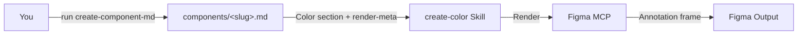

<Frame>
  <video src="/images/specs/color-output.mp4" autoPlay muted loop playsInline alt="Example color annotation output in Figma" />
</Frame>

Color annotation specs document which design tokens are used for backgrounds, text, icons, and state layers across different component states and variants.

<Tip>
  `create-color` now renders **from the [Component Markdown](/specs/component-md) source of truth**. Run `create-component-md` first to produce `components/<slug>.md`; this skill reads its Color section + `render-meta` and renders the Figma frame. It no longer re-extracts from Figma, and it fails fast if the `.md` is missing.
</Tip>

## What you need

- A **component `.md`** produced by `create-component-md` (run it first — `create-component-md` needs a `_base.json` from the uSpec Extract plugin). Tell the skill where this `.md` lives — `components/<slug>.md` is only `create-component-md`'s default output path; the file can live anywhere. Without it this skill aborts.
- **Figma MCP** connected (Console MCP with Desktop Bridge, or native Figma MCP) — used only to render the frame.
- Context about variants, states, or color modes is captured upstream by `create-component-md`; nothing extra is needed here.

<Tip>
  If your component uses Figma variable modes for color variants (e.g., a "Tag color" collection with Default, Success, Warning modes), mention it in your prompt. The agent checks for these automatically, but calling them out helps.
</Tip>

## How to use

Reference the skill and pass the component `.md`. Add a render destination or any extra context the spec can't carry:

<Tabs>
  <Tab title="Cursor">
    ```
    @create-color ./components/button.md

    Render next to the component at https://www.figma.com/design/abc123/Components?node-id=100:200
    ```
  </Tab>
  <Tab title="Claude Code">
    ```
    /create-color ./components/button.md

    Render next to the component at https://www.figma.com/design/abc123/Components?node-id=100:200
    ```
  </Tab>
  <Tab title="Codex">
    ```
    $create-color ./components/button.md

    Render next to the component at https://www.figma.com/design/abc123/Components?node-id=100:200
    ```
  </Tab>
</Tabs>

## What it generates

The agent inspects your component's fills, strokes, and variables, then maps every color-bearing element to its design token and renders the documentation directly in your Figma file.

### How the output is organized

The structure depends on your component type:

<Tabs>
  <Tab title="Static content">
Components without interactive states (headers, cards, labels) get a single table mapping each element to its token.
  </Tab>
  <Tab title="Interactive">
Components with states (buttons, checkboxes, inputs) get a separate table per state showing how tokens change across enabled, hovered, pressed, and disabled.
  </Tab>
  <Tab title="Multi-variant">
Components with style or color variants (default + danger, primary + secondary) get separate variant sections, each with their own state tables.
  </Tab>
  <Tab title="Variable mode">
Components where color is controlled by a Figma variable collection (tag colors, badge styles, emphasis levels) get one section per mode value.
  </Tab>
</Tabs>

<Note>
  Light and dark themes don't need separate documentation. Semantic tokens handle theme switching automatically.
</Note>

## How it works

The color skill consumes the Component Markdown source of truth: token mapping, state tables, variant organization, and variable-mode sections were already decided by `create-component-md`, so deterministic scripts render directly from the `.md` while AI reasoning is limited to resolving the parsed spec onto live Figma layers.

<Badge color="green" size="sm" shape="pill">55% Deterministic</Badge> <Badge color="purple" size="sm" shape="pill">45% AI Reasoning</Badge>



<Steps>
  <Step title="Require the .md">
    The skill requires `components/<slug>.md` (produced by `create-component-md`) and fails fast if it is missing — it does not re-extract from Figma.
  </Step>
  <Step title="Parse the Color section">
    The skill parses the `.md`'s Color section (per-element token mappings, per-state and per-variant tables, variable-mode sections) plus the `render-meta` block, which resolves sections and layers back to live Figma layer ids.
  </Step>
  <Step title="Build render inputs">
    State tables, variant sections, and variable-mode sections are assembled directly from the parsed `.md` — no live extraction walk. The single whitelisted live read is `getLocalVariableCollectionsAsync()`, used only to render mode previews for variable-mode sections.
  </Step>
  <Step title="Import template">
    The color documentation template is imported from the library, instantiated, and detached into an editable frame.
  </Step>
  <Step title="Render">
    The skill fills header fields, builds state tables, variant sections, and variable mode sections, locating each target by `render-meta` layer id with a name-match fallback on the rendered instance.
  </Step>
  <Step title="Validate">
    A screenshot is captured and checked for completeness. Issues are fixed automatically for up to 3 iterations.
  </Step>
</Steps>

<Tip>
The skill renders programmatically, so the output is consistent and repeatable. Running it on the same component produces identical results.
</Tip>

## Tips for better output

- **List all states**: enabled, hovered, pressed, disabled. The agent maps tokens per state
- **Mention color variants**: if your component has Default and Danger (or similar), describe both
- **Call out variable mode collections**: if color is controlled by a Figma variable collection (e.g., *"Tag color"* with Default, Success, Warning, Error modes), name the collection and its modes in your prompt. The agent checks for these automatically, but explicit mention ensures nothing is missed
- **Note sub-components**: if your component contains another component (e.g., a Button inside a Section heading), the agent references it instead of duplicating its tokens
