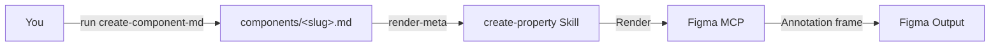

<Frame>
  <video src="/images/specs/property-output.mp4" autoPlay muted loop playsInline alt="Example property annotation output in Figma" />
</Frame>

The property skill documents every configurable property of a component — variant axes, boolean toggles, variable modes, and child component properties — each shown as a visual exhibit with live instance previews.

<Tip>
  `create-property` now renders **from the [Component Markdown](/specs/component-md) source of truth**. Run `create-component-md` first to produce `components/<slug>.md`; this skill takes the component's property identity from the `.md`'s `render-meta` block and renders the Figma frame. It no longer re-extracts from Figma, and it fails fast if the `.md` is missing.
</Tip>

## What you get

<CardGroup cols={2}>
  <Card title="Variant axis exhibits" icon="sliders">
    One section per axis (e.g., Size, Hierarchy) with instance previews for every option.
  </Card>
  <Card title="Boolean toggle exhibits" icon="toggle-on">
    On/off states shown side by side with defaults labeled.
  </Card>
  <Card title="Variable mode properties" icon="swatchbook">
    Shape, density, and other variable-mode properties rendered as visual chapters.
  </Card>
  <Card title="Child component chapters" icon="diagram-project">
    Nested component properties shown in-context on parent instances.
  </Card>
</CardGroup>

## What you need

- A **component `.md`** produced by `create-component-md` (run it first — `create-component-md` needs a `_base.json` from the uSpec Extract plugin). Tell the skill where this `.md` lives — `components/<slug>.md` is only `create-component-md`'s default output path; the file can live anywhere. Without it this skill aborts.
- **Figma MCP** connected (Console MCP with Desktop Bridge, or native Figma MCP) — used only to render the frame.
- Context about the component is captured upstream by `create-component-md`; nothing extra is needed here.

<Note>
  Properties has no dedicated body section in the `.md`. It rebuilds the property model — variant axes, boolean defs, variable modes, slot contents, and sub-component identities — directly from the `.md`'s `render-meta` block.
</Note>

## How to use

Reference the skill and pass the component `.md`. Add a render destination or any extra context the spec can't carry:

<Tabs>
  <Tab title="Cursor">
    ```
    @create-property ./components/button.md

    Render next to the component at https://www.figma.com/design/abc123/Components?node-id=100:200
    ```
  </Tab>
  <Tab title="Claude Code">
    ```
    /create-property ./components/button.md

    Render next to the component at https://www.figma.com/design/abc123/Components?node-id=100:200
    ```
  </Tab>
  <Tab title="Codex">
    ```
    $create-property ./components/button.md

    Render next to the component at https://www.figma.com/design/abc123/Components?node-id=100:200
    ```
  </Tab>
</Tabs>

<Tip>
  To place the annotation in a different file or page, add a destination link to your prompt:
  `Destination: https://www.figma.com/design/xyz789/Docs?node-id=0-1`
</Tip>

## What it generates

| Output | Description |
|--------|-------------|
| Variant axis exhibits | One section per axis with instance previews for every option |
| Boolean toggle exhibits | On/off states shown side by side |
| Variable mode exhibits | Shape, density, and other variable-driven properties |
| Child component chapters | Nested component properties rendered on parent instances |
| Default labels | The default value for each property is labeled |

The skill rebuilds the property model from the `.md`'s `render-meta` block (`componentPropertyDefinitions`, variant axes, boolean defs, variable modes), so the output adapts to any component regardless of how many properties it has.

## How it works

The property skill is primarily deterministic — scripts rebuild the property model from `render-meta`, lay out the template, and render instances, while AI reasoning handles normalization decisions and label generation.

<Badge color="green" size="sm" shape="pill">70% Deterministic</Badge> <Badge color="purple" size="sm" shape="pill">30% AI Reasoning</Badge>



<Steps>
  <Step title="Require the .md">
    The skill requires `components/<slug>.md` (produced by `create-component-md`) and fails fast if it is missing — it does not re-extract from Figma.
  </Step>
  <Step title="Rebuild the property model">
    Properties has no dedicated body section, so the skill rebuilds the property model — `componentPropertyDefinitions`, `variantProperties`, variable modes, and child component properties — directly from the `.md`'s `render-meta` block.
  </Step>
  <Step title="Build render inputs">
    Coupled axes, container-gated booleans, unified slots, and sibling booleans are consolidated from the rebuilt model to avoid redundant exhibits — no live extraction walk.
  </Step>
  <Step title="Import template">
    The property documentation template is imported from the library, instantiated, and detached into an editable frame.
  </Step>
  <Step title="Render">
    The skill fills header fields, clones chapter sections, creates component instances for visual exhibits, and labels defaults, resolving each exhibit against the live component set by name-match.
  </Step>
  <Step title="Validate">
    A screenshot is captured and checked for completeness. Issues are fixed automatically for up to 3 iterations.
  </Step>
</Steps>

<Tip>
The skill renders programmatically, so the output is consistent and repeatable. Running it on the same component produces identical results.
</Tip>

## Tips for better output

- **Use component sets**: The skill expects a component set (the dashed-border container in Figma) or a standalone component, not an instance
- **Check variant coverage**: If a variant axis like "Hierarchy" doesn't have variants for every combination of other axes, the skill finds the closest available match automatically
- **Name your layers**: Descriptive layer names help the skill correctly discover and label child component properties
- **Variable modes**: If your component uses variable modes (e.g., shape or density collections), the skill detects and renders them automatically
