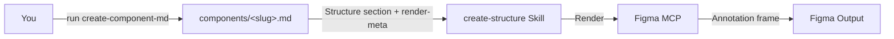

<Frame>
  <video src="/images/specs/structure-output.mp4" autoPlay muted loop playsInline alt="Example structure spec output in Figma" />
</Frame>

Structure specs document component measurements such as heights, widths, padding, and gaps, and how those values change across variants like density, size, and shape.

<Tip>
  `create-structure` now renders **from the [Component Markdown](/specs/component-md) source of truth**. Run `create-component-md` first to produce `components/<slug>.md`; this skill reads its Structure section + `render-meta` and renders the Figma frame. It no longer re-extracts from Figma, and it fails fast if the `.md` is missing.
</Tip>

## What you need

- A **component `.md`** produced by `create-component-md` (run it first — `create-component-md` needs a `_base.json` from the uSpec Extract plugin). Tell the skill where this `.md` lives — `components/<slug>.md` is only `create-component-md`'s default output path; the file can live anywhere. Without it this skill aborts.
- **Figma MCP** connected (Console MCP with Desktop Bridge, or native Figma MCP) — used only to render the frame.
- Context about density modes, size variants, or specific sub-components is captured upstream by `create-component-md`; nothing extra is needed here.

<Tip>
  Tell the agent which variant axes affect dimensions. A button might vary by size, while a list item varies by density. The agent checks both explicit variants and variable mode collections.
</Tip>

## How to use

Reference the skill and pass the component `.md`. Add a render destination or any extra context the spec can't carry:

<Tabs>
  <Tab title="Cursor">
    ```
    @create-structure ./components/list-item.md

    Render next to the component at https://www.figma.com/design/abc123/Components?node-id=100:200
    ```
  </Tab>
  <Tab title="Claude Code">
    ```
    /create-structure ./components/list-item.md

    Render next to the component at https://www.figma.com/design/abc123/Components?node-id=100:200
    ```
  </Tab>
  <Tab title="Codex">
    ```
    $create-structure ./components/list-item.md

    Render next to the component at https://www.figma.com/design/abc123/Components?node-id=100:200
    ```
  </Tab>
</Tabs>

<Tip>
  To place the annotation in a different file or page, add a destination link to your prompt:
  `Destination: https://www.figma.com/design/xyz789/Docs?node-id=0-1`
</Tip>

## What it generates

The agent measures your component and renders a documentation frame directly in your Figma file with tables showing how values change across variants.

| Aspect | What it covers |
|--------|---------------|
| Container dimensions | Heights, widths, min/max constraints |
| Padding and spacing | Horizontal and vertical padding, gaps between elements |
| Sub-component dimensions | Sizes for icons, avatars, and other nested elements |
| Token references | Links values to design tokens when they exist |
| Composition mapping | How parent sizes map to sub-component sizes |

### How tables are organized

Each section covers a part of the component (container, leading content, labels, trailing content). Columns represent variants, either sizes or density modes, so you can see how values change across configurations.

<Note>
  Some dimensional properties are controlled via Figma variable modes (like density) rather than explicit variant axes. The agent checks for both automatically.
</Note>

## How it works

The structure skill consumes the Component Markdown source of truth: the dimensional values, section plan, and design-intent notes were already decided by `create-component-md`, so deterministic scripts render tables and measurements from the `.md` while AI reasoning is limited to resolving the parsed spec onto live Figma layers.

<Badge color="green" size="sm" shape="pill">60% Deterministic</Badge> <Badge color="purple" size="sm" shape="pill">40% AI Reasoning</Badge>



<Steps>
  <Step title="Require the .md">
    The skill requires `components/<slug>.md` (produced by `create-component-md`) and fails fast if it is missing — it does not re-extract from Figma.
  </Step>
  <Step title="Parse the Structure section">
    The skill parses the `.md`'s Structure section (per-section dimension tables, token bindings, design-intent notes) plus the `render-meta` block, which resolves sections, row-groups, and boolean-gated layers back to live Figma layer ids.
  </Step>
  <Step title="Build render inputs">
    Sections, rows, token references, measurement targets, and sub-component anchors are assembled directly from the parsed `.md` and `render-meta` — no live extraction walk.
  </Step>
  <Step title="Import template">
    The structure documentation template is imported from the library, instantiated, and detached into an editable frame.
  </Step>
  <Step title="Render">
    Deterministic scripts fill tables, place preview instances, and add native Figma measurements, locating each target by `render-meta` layer id with a name-match + live bbox fallback on the rendered instance.
  </Step>
  <Step title="Validate">
    A screenshot is captured and checked for completeness. Issues are fixed automatically for up to 3 iterations.
  </Step>
</Steps>

<Note>
  Roughly 60% of the pipeline is deterministic scripts (parsing the `.md`, rendering tables, measurements) and 40% is AI reasoning (resolving the spec onto live layers, completeness checks). Output is highly consistent across runs.
</Note>

## Tips for better output

- **Specify which parts to include**: container, leading content, labels, trailing content, dividers
- **Mention density or size variants**: the agent organizes columns based on these. If density is controlled via variable modes (Compact, Default, Spacious), mention the mode names
- **Describe composition relationships**: if your component is composed of multiple sub-components (e.g., Text Field = Label + Input + Hint Text), describe how parent sizes map to child sizes
- **Call out sub-components**: if a sub-component has its own spec (e.g., Avatar inside a List item), the agent cross-references it
- **Note any state-specific dimensions**: some states introduce additional properties (e.g., a focused input gaining an inner border that doesn't exist in the default state)
